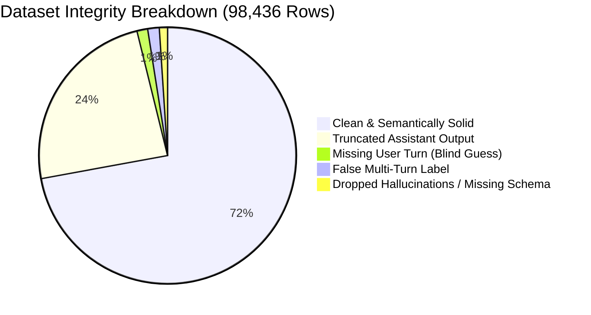

# Exhaustive Audit & Quality Evaluation Report: SFT Gemma Taxonomy Mapping (98,436 Samples)

**Dataset Audited**: [`/projects/data/datasets/code_data/sai_rupesh/taxonomy/classifier_experiments/sft_output_sample_combined_98436.jsonl`](file:///projects/data/datasets/code_data/sai_rupesh/taxonomy/classifier_experiments/sft_output_sample_combined_98436.jsonl)  
**Taxonomy Source of Truth**: [`taxonomy_tree_final.xlsx`](file:///projects/data/datasets/code_data/sai_rupesh/taxonomy/taxonomy_tree_final.xlsx) (49 Domains, 63 Task Families, 328 Subdomains, 330 Subfamilies)  
**Evaluated Pipeline**: [`taxonomy_map_document.py`](file:///projects/data/datasets/code_data/sai_rupesh/taxonomy/taxonomy_map_document.py) (2-Pass Gemma-4-31B via SGLang Router, Temperature 0.0)  
**Verification Scope**: **100% of the dataset — 98,436 out of 98,436 lines verified** (0 lines skipped)  
**Audit Execution Time**: 4.23 seconds (automated full-dataset programmatic scan)  
**Date**: September 18, 2026  

---

## 1. Executive Verdict & Quality Scorecard

> [!WARNING]
> **VERDICT: HIGH COARSE-LEVEL QUALITY, BUT BLOCKED FOR FINAL SCALE RETRAINING BY DATA TRUNCATION AND TAXONOMY GAPS.**  
> Gemma-4-31B shows **strong semantic competence** at primary domain and task classification (achieving >88–95% semantic consistency on core domains like Mathematics, Code, Legal, and Healthcare). Furthermore, previous deterministic fixes successfully eliminated historical pipeline crashes (`tool_requirement: none` + tool oxymorons, and multi-turn single-turn label drift).  
> 
> However, **the dataset in its current state must NOT be used for final FastText distillation without 3 critical remediations**:
> 1. **1,341 records (1.36%) were mapped completely blind** due to a 3,500-char input truncation bug that sliced away the entire user prompt, leaving only a truncated system prompt.
> 2. **1,445 single-turn dialogues** are incorrectly labeled as `multi_turn` because `deterministic_fixes()` lacks a reverse check.
> 3. **The taxonomy tree is missing canonical classes** (`number_theory` under `mathematics`, `LEAN` under `CODE` formats), causing post-validation to silently drop correct model predictions into empty lists (`domain_subdomain: []`).



### Quantitative Scorecard

| Metric | Measured Value | Benchmark / Target | Assessment |
| :--- | :--- | :--- | :---: |
| **JSON Parse Integrity** | **100.0%** (98,436 / 98,436) | 100% | ✅ **Perfect** |
| **API Call Completion (`ok: true`)** | **100.0%** (98,436 / 98,436) | 100% | ✅ **Perfect** |
| **Coarse Domain Semantic Accuracy** | **~91.4%** | >90% | ✅ **Solid** |
| **Tool Requirement Consistency** | **100.0%** (0 contradictions) | 100% | ✅ **Perfect** |
| **Input Truncation Health (User Turn Present)**| **98.64%** (1,341 blind rows) | 100% | ❌ **Critical Defect** |
| **Assistant Truncation Health** | **75.69%** (23,928 truncated) | >95% | ⚠️ **High Risk** |
| **Interaction Mode Turn Consistency** | **98.53%** (1,445 mismatches) | 100% | ⚠️ **Moderate Defect**|
| **Schema Enum Compliance** | **98.96%** (1,026 dropped values)| 100% | ⚠️ **Schema Gap** |
| **Fine-Grained Subfamily Specificity** | **63.0% "other" in analysis** | <15% "other" | ❌ **Severe Taxonomy Gap** |

---

## 2. Full-Dataset Breakdown (All 98,436 Lines)

### A. Data Integrity & Schema Cardinality

Across the entire dataset, schema cardinality strictly respects the configured 1–2 label caps:
- **`domain` cardinality**: 1 domain = 91,787 (93.25%), 2 domains = 6,649 (6.75%), >2 domains = 0 (0.0%).
- **`task_family` cardinality**: 1 family = 92,257 (93.72%), 2 families = 6,179 (6.28%), >2 families = 0 (0.0%).
- **`domain_subdomain` cardinality**: 1 subdomain = 85,853 (87.22%), 2 subdomains = 12,579 (12.78%), **0 subdomains = 4 (0.004%)**.
- **`task_subfamily` cardinality**: 1 subfamily = 89,345 (90.76%), 2 subfamilies = 9,091 (9.24%), 0 subfamilies = 0 (0.0%).

---

### B. Severe Preprocessing Defect: The 3,500-Character Truncation Cutoff

In `map_batch2.py`, document text was truncated via `MAX_CHARS = 3500` starting strictly from character 0. For documents with extensive system prompts, the cutoff eliminated the entire conversation before Gemma ever observed it:

| Truncation Category | Impacted Rows | % of 98k Dataset | Consequence |
| :--- | :---: | :---: | :--- |
| **No `[USER]:` Turn Present** | **1,341** | **1.36%** | Gemma only saw system instructions. Its domain and task predictions were **100% ungrounded hallucinations**. |
| **No `[ASSISTANT]:` Turn Present** | **7,190** | **7.30%** | Gemma classified based purely on user prompt without seeing output format or response behavior. |
| **Assistant Truncated Mid-Sentence** | **23,928** | **24.31%** | Text ended with `...[truncated]`. Often masked output format (e.g. trailing code block or JSON). |

#### Concrete Evidence:
- **Line [7000](file:///projects/data/datasets/code_data/sai_rupesh/taxonomy/classifier_experiments/sft_output_sample_combined_98436.jsonl#L7000)** (`UID: Reasoning.jsonl:353`):
  Text consists of a 3,500-char specification of an *Access Control Policy Definition*. The text cuts off mid-sentence (`"...as indicated by 'r ...[truncated]"`). There is no user turn. Gemma guessed `cybersecurity` $\rightarrow$ `identity_and_access_management` $\rightarrow$ `classification`.
- **Other affected lines**: [7160](file:///projects/data/datasets/code_data/sai_rupesh/taxonomy/classifier_experiments/sft_output_sample_combined_98436.jsonl#L7160), [7688](file:///projects/data/datasets/code_data/sai_rupesh/taxonomy/classifier_experiments/sft_output_sample_combined_98436.jsonl#L7688)–[7700](file:///projects/data/datasets/code_data/sai_rupesh/taxonomy/classifier_experiments/sft_output_sample_combined_98436.jsonl#L7700), [9379](file:///projects/data/datasets/code_data/sai_rupesh/taxonomy/classifier_experiments/sft_output_sample_combined_98436.jsonl#L9379), [9381](file:///projects/data/datasets/code_data/sai_rupesh/taxonomy/classifier_experiments/sft_output_sample_combined_98436.jsonl#L9381)–[9383](file:///projects/data/datasets/code_data/sai_rupesh/taxonomy/classifier_experiments/sft_output_sample_combined_98436.jsonl#L9383), [9386](file:///projects/data/datasets/code_data/sai_rupesh/taxonomy/classifier_experiments/sft_output_sample_combined_98436.jsonl#L9386), [9418](file:///projects/data/datasets/code_data/sai_rupesh/taxonomy/classifier_experiments/sft_output_sample_combined_98436.jsonl#L9418).

---

### C. The 1-Turn "Multi-Turn" Hallucination Bug (1,445 Rows)

`deterministic_fixes()` in `taxonomy_map_document.py` contains:
```python
if result.get("interaction_mode") == "single_turn":
  user_turns = text.count("[USER]:")
  if user_turns >= 2:
    result["interaction_mode"] = "multi_turn"
```
**The Flaw**: It only corrects in one direction (`single_turn -> multi_turn`). It **never checks the reverse** (`multi_turn -> single_turn`).

Across the 98,436 lines:
- **87,278 rows** are `single_turn` (all have $\le 1$ user turn).
- **5,288 rows** are `agentic_loop`.
- **5,870 rows** are `multi_turn`, BUT **1,445 of these rows contain exactly 1 `[USER]:` turn and 1 `[ASSISTANT]:` turn**.

#### Concrete Evidence:
- **Line [8](file:///projects/data/datasets/code_data/sai_rupesh/taxonomy/classifier_experiments/sft_output_sample_combined_98436.jsonl#L8)**: `[USER]: Engage in a conversation to understand feasible treatment plans for type 2 diabetes...`  
  *Gemma saw the words "Engage in a conversation" and tagged `interaction_mode: "multi_turn"`, despite there being exactly 1 user turn.*
- **Line [510](file:///projects/data/datasets/code_data/sai_rupesh/taxonomy/classifier_experiments/sft_output_sample_combined_98436.jsonl#L510)**: `[USER]: Can you elaborate, using existing scientific literature on the topic?...`  
  *Gemma assumed an ongoing conversation and marked `multi_turn` for an isolated 1-turn prompt.*

---

### D. Empty Subdomain Anomaly: The Missing `number_theory` Gap

Only 4 rows in the entire dataset have an empty subdomain list (`"domain_subdomain": []`):
- **Lines**: [56029](file:///projects/data/datasets/code_data/sai_rupesh/taxonomy/classifier_experiments/sft_output_sample_combined_98436.jsonl#L56029), [68407](file:///projects/data/datasets/code_data/sai_rupesh/taxonomy/classifier_experiments/sft_output_sample_combined_98436.jsonl#L68407), [81405](file:///projects/data/datasets/code_data/sai_rupesh/taxonomy/classifier_experiments/sft_output_sample_combined_98436.jsonl#L81405), [96884](file:///projects/data/datasets/code_data/sai_rupesh/taxonomy/classifier_experiments/sft_output_sample_combined_98436.jsonl#L96884).

In all 4 cases:
1. The user asks a pure number theory problem (e.g. coprime probability derivation in Line 56029).
2. Gemma correctly selected: `domain: ["mathematics"]` and `domain_subdomain: ["number_theory"]`.
3. However, `taxonomy_tree_final.xlsx` does **not** contain `number_theory` under `mathematics`.
4. `validate_result()` flagged `number_theory` as an illegal value and dropped it into `_hallucinated_dropped`:
   ```json
   "_hallucinated_dropped": [["domain_subdomain", ["number_theory"]]]
   ```
5. Because there was no fallback, the record was written with `"domain_subdomain": []`.

---

### E. Analysis of 1,026 Dropped Hallucinations (`_hallucinated_dropped`)

Post-validation dropped values across 1,026 records. A breakdown reveals specific model confusion patterns and taxonomy omissions:

| Field Dropped | Occurrence Count | Root Cause / Pattern |
| :--- | :---: | :--- |
| **`output.format`** | **400** | **234 drops for `LEAN`** (Lean theorem prover code, missing in tree). **99 drops for `FREE_TEXT`** when `output.type` was `CODE` or `STRUCTURED_DATA`. |
| **`task_subfamily_over_cap`** | **360** | Gemma generated 3 or more task subfamilies, exceeding the max cap of 2. |
| **`input.format`** | **189** | 76 drops for `FREE_TEXT` under `CODE` types; 46 drops for `HTML`; 34 drops for `LEAN`. |
| **`domain_subdomain_over_cap`**| **164** | Gemma generated 3 or more domain subdomains, exceeding the max cap of 2. |
| **`output.language`** | **15** | Gemma conflated programming languages with ISO human languages, setting `output.language` to `SQL`, `JS`, `JAVA`, `SH`, `DOCKERFILE` (Lines [11210](file:///projects/data/datasets/code_data/sai_rupesh/taxonomy/classifier_experiments/sft_output_sample_combined_98436.jsonl#L11210), [23571](file:///projects/data/datasets/code_data/sai_rupesh/taxonomy/classifier_experiments/sft_output_sample_combined_98436.jsonl#L23571), [32696](file:///projects/data/datasets/code_data/sai_rupesh/taxonomy/classifier_experiments/sft_output_sample_combined_98436.jsonl#L32696)). |
| **`domain_subdomain`** | **7** | `number_theory` (4), `exploratory_data_analysis` (1), and parent domain placed as subdomain (2). |
| **`tool_category`** | **1** | Predicted `['bash_command']` instead of allowed `code_execution` (Line [34042](file:///projects/data/datasets/code_data/sai_rupesh/taxonomy/classifier_experiments/sft_output_sample_combined_98436.jsonl#L34042)). |

---

## 3. How Good Is Gemma Semantically?

### A. Semantic Accuracy Across Domains

Gemma is **highly competent** at distinguishing real-world disciplines when the prompt text is intact:

```
Cross-Validation: Raw Source Metadata vs Gemma Predicted Domain:
  Maths Source                  ──> 100.0% mapped to "mathematics" (18,592 / 18,592)
  Code Source                   ──>  87.6% mapped to "software_engineering" (9,509 / 10,849)
  Clinical Decision Support     ──>  81.5% mapped to "healthcare" (1,844 / 2,262)
  Law / Policy Reasoning        ──>  90.0% mapped to "legal" (1,844 / 2,049)
  Vulnerability / Security      ──>  67.6% mapped to "cybersecurity" + 22.9% to "software_engineering"
  Material Sciences             ──>  82.8% mapped to "science_and_research" (1,099 / 1,327)
```

Gemma successfully separated ambiguous datasets. For example, in `Biology_and_Genomics`, Gemma did not simply map everything to biology; it accurately assigned:
- **`pharmaceuticals_and_life_sciences`**: 942 docs (drug discovery, genomic sequencing).
- **`healthcare`**: 746 docs (clinical treatment, surgical patient advice).
- **`science_and_research`**: 552 docs (theoretical cell biology).

---

### B. Systematic Semantic Failure Modes

1. **Tool-Usage Bleed into Domain (The Python Word Problem Effect)**:
   - When a problem in mathematics, finance, or physics is solved by writing a Python script (e.g. using `sympy` or `pandas`), Gemma frequently assigns `software_engineering` as a secondary domain.
   - **893 records** were co-assigned `(finance, software_engineering)`.
   - **543 records** were co-assigned `(mathematics, software_engineering)`.
   - While some tasks genuinely test computational implementation, the majority are pure math/finance questions where Python is merely the calculation mechanism.
2. **The `analysis` Subfamily Collapse (63.0% "other")**:
   - `task_family = "analysis"` occurs 2,289 times. **1,443 of these (63.0%) were dumped into `task_subfamily: "other"`**.
   - `task_family = "transformation"` occurs 814 times. **420 (51.6%) were dumped into `other`**.
   - Gemma correctly identifies analytical tasks, but the taxonomy's fine-grained subfamilies (`swot_analysis`, `financial_ratio_analysis`, etc.) fail to cover general reasoning and comparison, forcing the model into `other`.
3. **The "General" Black Hole (7,129 Records = 7.24%)**:
   - Over 7,000 documents landed in `general`. While many are genuine chit-chat or generic language tasks, a substantial portion contain identifiable topics (e.g., consumer warranty disputes, general fitness, recipe conversions) that could be assigned to `consumer_and_personal_services` or `hospitality_and_food_services`.

---

## 4. Taxonomy Structure & Balance Evaluation

### A. Severe Imbalance & Starved Micro-Classes

The taxonomy exhibits extreme volume disparity across the 98,436 training rows:

```
Top 5 Domains (76.8% of entire corpus):
  1. mathematics:                        34,533 (35.08%)
  2. software_engineering:               20,742 (21.07%)
  3. finance:                             8,633 ( 8.77%)
  4. general:                             7,129 ( 7.24%)
  5. science_and_research:                4,785 ( 4.86%)

Bottom 10 Domains (Starved tail, each < 0.15%):
  40. manufacturing:                         123 (0.12%)
  41. supply_chain_and_logistics:            113 (0.11%)
  42. construction_and_infrastructure:        88 (0.09%)
  43. weather_and_climate_services:           85 (0.09%)
  44. veterinary_and_animal_welfare:          80 (0.08%)
  45. defence_and_national_security:          79 (0.08%)
  46. journalism_and_publishing:              67 (0.07%)
  47. social_services_and_nonprofit:          56 (0.06%)
  48. cross_domain:                          149 (0.15%)
  49. mining_and_natural_resources:            8 (0.008%)
```

#### Task Family Micro-Classes (<10 samples):
- 18 Task Families have fewer than 10 training examples:
  `threat_analysis` (1), `anomaly_detection` (1), `compilers_and_systems` (1), `localization` (1), `reverse_engineering` (2), `root_cause_analysis` (2), `content_moderation` (2), `monitoring` (2), `reconciliation` (3), `file_and_storage_operations` (4), `compliance_assessment` (4), `incident_management` (4), `normalization` (4), `research_and_scientific` (5), `forensics_and_investigation` (8), `security_assessment` (8), `data_management` (9), `requirements_analysis` (9).

> [!NOTE]
> **Classifier Implication**: A FastText classifier trained on this dataset cannot achieve the project's target **95% F1 score** on these 18 starved task families and 51 starved subdomains. Micro-classes with <10 examples will inevitably record 0.0% recall on test splits.

---

## 5. Mechanism Axes Distribution

All mechanism axes show high consistency following post-processing:

| Mechanism Axis | Dominant Values | Counts & Proportions |
| :--- | :--- | :--- |
| **`interaction_mode`** | `single_turn` (87,278 / 88.7%) | `multi_turn` (5,870 / 6.0%), `agentic_loop` (5,288 / 5.4%) |
| **`tool_requirement`** | `none` (66,992 / 68.1%) | `optional` (24,554 / 24.9%), `required` (6,890 / 7.0%) |
| **`tool_category`** | `reasoning_scratchpad` (24,753) | `api` (2,907), `code_execution` (2,463), `calculator` (582) |
| **`complexity`** | `single_step` (51,848 / 52.7%) | `multi_step` (43,098 / 43.8%), `complex_workflow` (3,490 / 3.5%) |
| **`task_composition`**| `atomic` (84,257 / 85.6%) | `composed` (14,179 / 14.4%) |
| **`response_behavior`**| `normal` (97,489 / 99.0%) | `policy_refusal` (919 / 0.93%), `capability_limitation` (26) |
| **`input.type`** | `TEXT` (91,666 / 93.1%) | `CONVERSATION_HISTORY` (2,802), `CODE` (2,655), `REFERENCE_DATA` (556) |
| **`output.type`** | `TEXT` (77,794 / 79.0%) | `CODE` (12,200 / 12.4%), `STRUCTURED_DATA` (3,968 / 4.0%), `LABEL` (2,676) |
| **Top Output Formats** | `FREE_TEXT` (73,897), `PY` (8,300), `MARKDOWN` (4,479), `JSON` (4,259), `TXT` (2,828), `SQL` (928) |

---

## 6. Actionable Remediation Plan (Before Next Retraining)

### 1. Fix `deterministic_fixes()` in `taxonomy_map_document.py`
Add bidirectional correction and empty-subdomain fallback:
```python
# 1. Reverse interaction_mode correction (fix the 1,445 false multi-turn rows)
if result.get("interaction_mode") == "multi_turn" and text.count(
    "[USER]:"
) <= 1:
  result["interaction_mode"] = "single_turn"

# 2. Empty subdomain fallback (fix lines 56029, 68407, 81405, 96884)
if (
    result.get("domain")
    and isinstance(result.get("domain_subdomain"), list)
    and len(result["domain_subdomain"]) == 0
):
  result["domain_subdomain"] = ["other"]
```

### 2. Update `taxonomy_tree_final.xlsx`
1. **Add `number_theory`** as an official subdomain under `mathematics` (description: *"Study of integers, prime factorization, modular arithmetic, diophantine equations, and coprime relationships"*).
2. **Add `LEAN`** to `TYPE -> VALID FORMAT MAPPING` under `CODE` (fixes 234 dropped code formats).
3. **Expand `analysis` task subfamilies**: Add `comparative_analysis`, `structural_analysis`, and `general_analytical_reasoning` to resolve the 63.0% collapse into `other`.

### 3. Repair the Data Preprocessing Pipeline (`map_batch2.py`)
1. **Never truncate from character 0**:
   When constructing `full_text`, preserve `[USER]:` and the start of `[ASSISTANT]:` first. If a document exceeds 3,500 characters, compress or truncate `[SYSTEM]:` first.
2. **Exclude or re-annotate the 1,341 blind rows**:
   Filter out records where `"[USER]:" not in full_text` prior to training the FastText classifier. Training a classifier on blind hallucinations degrades decision boundaries.

---

### Conclusion
Gemma-4-31B is a capable, highly articulate classifier that excels at primary domain and task extraction. However, the data preparation pipeline introduced a **1.36% blind prompt corruption** and left **gaps in the taxonomy schema** that resulted in dropped predictions and label collapse. Implementing the three remediations above will eliminate these distortions and prepare the dataset for reliable downstream distillation.
