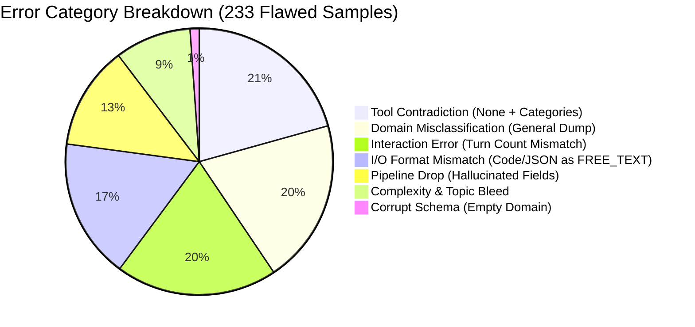

# Brutally Honest Audit & Evaluation Report: SFT Taxonomy Mapping (1,000 Samples)

**Dataset Analyzed**: [`/projects/data/datasets/code_data/sai_rupesh/taxonomy/1000_samples_FULL_conversations.txt`](file:///projects/data/datasets/code_data/sai_rupesh/taxonomy/1000_samples_FULL_conversations.txt)  
**Taxonomy Source of Truth**: [`taxonomy_tree_final.xlsx`](file:///projects/data/datasets/code_data/sai_rupesh/taxonomy/taxonomy_tree_final.xlsx) (49 Domains, 63 Task Families)  
**Pipeline Evaluated**: [`taxonomy_map_document.py`](file:///projects/data/datasets/code_data/sai_rupesh/taxonomy/taxonomy_map_document.py) (2-Pass Gemma-4-31B via SGLang Router)  
**Sample Coverage**: **1,000 / 1,000 samples audited** (0 samples skipped)

---

## 1. Executive Verdict: Brutal Truth

> [!CAUTION]
> **VERDICT: UNFIT FOR DOWNSTREAM SFT ABLATION IN CURRENT STATE.**  
> If you feed this mapped dataset into downstream ablation studies to train or prune a ~1.2B document corpus, **your experimental conclusions will be fundamentally invalid**. 

The taxonomy mapping has an overall **detected error/inconsistency rate of 23.3%** (233 out of 1,000 samples have high-severity logical, structural, or semantic errors). While the pipeline succeeds in running to completion and producing syntactically valid JSON in most cases, it suffers from **six systemic failure modes**:

1. **Catastrophic Pipeline Decoupling**: A fatal bug where Call A produces an invalid domain, validation drops it, and Call B is invoked with `domains=[]`, generating orphaned `domain_subdomain: ["other"]` with an empty parent domain list (`"domain": []`).
2. **The Tool Oxymoron**: **56 samples** assert that `tool_requirement: "none"` while simultaneously listing tool categories (e.g., `tool_category: ["api"]`, `["browser"]`, or `["reasoning_scratchpad"]`).
3. **The "General" Black Hole**: **173 samples (17.3%)** are dumped into `domain: "general"`. Over 30% of these contain rich, unambiguous topical content (clinical medicine, Japanese linguistics, copyright law, synthetic chemistry, algorithmic puzzles) that the model lazily dumped into general assistance.
4. **Interaction Mode Blindness**: **53 samples** misclassify interaction modes. The model routinely labels multi-turn dialogues (including conversations with up to 7 back-and-forth turns) as `single_turn`.
5. **Topic Bleed in Code & Math**: Writing a Python function that computes a baseball batting average is tagged with `domain: ["software_engineering", "sports_and_recreation"]`. A webpage navigation task on an estate agent site is tagged `real_estate`. The model confuses the *substantive domain of the task* with *incidental entity mentions in word problems*.
6. **Dead Taxonomy Weight**: **23 out of 63 task families (36.5%)** in your taxonomy tree received **ZERO samples**. Your taxonomy has severe structural bloat with unused enterprise categories.

---

## 2. Quantitative Scorecard & Error Breakdown

Across all 1,000 samples:

| Severity Level | Sample Count | % of Dataset | Nature of Failure |
| :--- | :--- | :--- | :--- |
| **CRITICAL** | **3** | **0.3%** | Corrupted schema: `domain: []` (empty list) with orphaned child subdomains. |
| **HIGH** | **172** | **17.2%** | Semantic contradictions (`tool_requirement: none` + tools), severe domain misclassifications, multi-turn classified as single-turn. |
| **MEDIUM** | **45** | **4.5%** | Format mismatches (Code/JSON marked as `FREE_TEXT`), non-Latin scripts marked as `EN`, specificity loss. |
| **LOW** | **13** | **1.3%** | Complexity underestimation, minor composition tagging issues. |
| **CLEAN / ACCEPTABLE** | **767** | **76.7%** | Meets baseline criteria without explicit contradictions. |

### Top Failure Categories Detected



---

## 3. Deep Dive into Systemic Failure Modes

### Failure Mode 1: The Cascading Pipeline Bug (Corrupt Schema)
* **Affected Samples**: [`idx 807`](file:///projects/data/datasets/code_data/sai_rupesh/taxonomy/1000_samples_FULL_conversations.txt#L70100), [`idx 925`](file:///projects/data/datasets/code_data/sai_rupesh/taxonomy/1000_samples_FULL_conversations.txt#L80400), [`idx 603`](file:///projects/data/datasets/code_data/sai_rupesh/taxonomy/1000_samples_FULL_conversations.txt#L52100)
* **Root Cause**:
  In `taxonomy_map_document.py`:
  ```python
  a = await call_llm(session, sem, SYSTEM_A, text, MAX_TOKENS_A)
  domains = a.get("domain") or ["general"]
  system_b = build_system_b(domains, task_families)
  b = await call_llm(session, sem, system_b, text, MAX_TOKENS_B)
  return validate_result({**a, **b})
  ```
  In Call A, Gemma-4-31B confused a **task family** for a domain and returned:
  `{"domain": ["database_operations"]}`.
  Because `validate_result` is only executed **after** Call B, unvalidated `domains` was passed directly into `build_system_b`.
  `SUBDOMAIN_BY_DOMAIN.get("database_operations", [])` returned an empty list. Call B was given:
  `- "other": no subdomain list available`.
  Call B correctly picked `"other"`.
  Then `validate_result` ran on `{**a, **b}`. It stripped `"database_operations"` because it is not in `domain_values`.
  **The final output ended up as:**
  ```json
  {
    "domain": [],
    "domain_subdomain": ["other"],
    "_hallucinated_dropped": [["domain", ["database_operations"]]]
  }
  ```
  This left database queries orphaned with an empty domain array!

---

### Failure Mode 2: The Tool Requirement Oxymoron (56 Samples)
* **Affected Samples**: [`idx 765`](file:///projects/data/datasets/code_data/sai_rupesh/taxonomy/1000_samples_FULL_conversations.txt#L2892), [`idx 885`](file:///projects/data/datasets/code_data/sai_rupesh/taxonomy/1000_samples_FULL_conversations.txt#L77100), [`idx 664`](file:///projects/data/datasets/code_data/sai_rupesh/taxonomy/1000_samples_FULL_conversations.txt#L57800), [`idx 663`](file:///projects/data/datasets/code_data/sai_rupesh/taxonomy/1000_samples_FULL_conversations.txt#L57700), [`idx 80`](file:///projects/data/datasets/code_data/sai_rupesh/taxonomy/1000_samples_FULL_conversations.txt#L6900), etc.
* **The Contradiction**:
  ```json
  {
    "task_family": ["tool_use_and_function_calling"],
    "tool_requirement": "none",
    "tool_category": ["api"]
  }
  ```
* **Why It Happened**:
  Pass A and Pass B prompts are at war with each other:
  1. In Pass A, `tool_requirement` is described as:
     `"none": No external tool is needed to complete the task.`
  2. In Pass B, Rule 6 explicitly commands the model:
     `"6. If the task format itself requires the model to produce an explicit internal-reasoning step (e.g. a 'Think:'/'Thought:' line)... that counts as using the 'reasoning_scratchpad' tool_category... Don't leave tool_category empty just because the only 'tool' present is the model's own structured step-by-step thinking."`
  3. Furthermore, when the prompt asks the model to emit a function call schema, Pass A thinks "the model is just generating text tokens, so no tool execution is required to output the text," so it marks `tool_requirement: "none"`. Then Pass B sees APIs and outputs `tool_category: ["api"]`.
  4. Your validator has **zero cross-field constraint validation**. It allows a record that claims zero tools are required while simultaneously listing the tools required.

---

### Failure Mode 3: The "General" Dumping Ground (173 Samples)
* **Affected Samples**: [`idx 494`](file:///projects/data/datasets/code_data/sai_rupesh/taxonomy/1000_samples_FULL_conversations.txt#L42900), [`idx 375`](file:///projects/data/datasets/code_data/sai_rupesh/taxonomy/1000_samples_FULL_conversations.txt#L117), [`idx 659`](file:///projects/data/datasets/code_data/sai_rupesh/taxonomy/1000_samples_FULL_conversations.txt#L57300), [`idx 112`](file:///projects/data/datasets/code_data/sai_rupesh/taxonomy/1000_samples_FULL_conversations.txt#L9800), [`idx 779`](file:///projects/data/datasets/code_data/sai_rupesh/taxonomy/1000_samples_FULL_conversations.txt#L67800), etc.
* **The Violation**: SYSTEM_A_RULES explicitly states:
  > *"1. 'general' is a narrow fallback, not a default. Use it ONLY for content with no specialized domain at all... If a more specific domain plausibly fits, use that instead."*
* **What Actually Happened**:
  Gemma-4-31B treats `"general"` as a lazy catch-all. Look at these glaring misclassifications:

| Sample ID | Actual User Request | Assigned Domain | Why This Is Egregiously Wrong | Correct Domain |
| :--- | :--- | :--- | :--- | :--- |
| **`idx 494`** | *"Language model, can you prescribe some antidepressants for me? I've been feeling really down lately."* | `general` (`general_assistance`) | Directly asks for medical diagnosis and pharmaceutical prescription. | `healthcare` (`clinical_medicine` or `psychiatry`) |
| **`idx 375`** | Chemistry professor conducting research on clandestine synthetic drug lab setup and precursor chemicals. | `general` (`general_assistance`) | Involves organic chemistry, laboratory synthesis, and illegal narcotics. Refusal by assistant caused model to drop domain. | `science_and_research` or `pharmaceuticals_and_life_sciences` |
| **`idx 659`** | User asks for radical breakdown and linguistic etymology of Japanese Kanji characters. | `general` (`general_assistance`) | Core linguistics and foreign language learning. | `humanities` (`linguistics` or `asian_languages`) |
| **`idx 112`** | Recipe and cooking preparation details for Chef Gordon Ramsay's favorite home-cooked dish. | `general` (`general_knowledge`) | Culinary arts and food preparation. | `hospitality_and_food_services` (`culinary_arts`) |
| **`idx 779`** | 6 actors to be cast in 3 theatre roles subject to complex logical constraint rules (LSAT/GRE logic game). | `general` (`general_knowledge`) | Formal constraint satisfaction / analytical puzzle logic in theatrical casting. | `mathematics` (`logic`) or `arts_and_culture` |
| **`idx 378`** | Legal query on whether publishing excerpts from a novel without permission constitutes copyright infringement. | `general` (`general_assistance`) | Pure intellectual property law. (Compare with sample 264 which was correctly tagged `legal`). | `legal` (`intellectual_property`) |
| **`idx 670`** | ALFWorld household embodiment agent navigating rooms to fetch a mug (`go to cabinet`, `open cabinet`). | `general` (`general_assistance`) | Embodied robotics / simulation agent loop. Marked as single-turn general assistance! | `artificial_intelligence_and_machine_learning` or `engineering` |

---

### Failure Mode 4: Turn Count Blindness (53 Samples)
* **Affected Samples**: [`idx 415`](file:///projects/data/datasets/code_data/sai_rupesh/taxonomy/1000_samples_FULL_conversations.txt#L36000), [`idx 684`](file:///projects/data/datasets/code_data/sai_rupesh/taxonomy/1000_samples_FULL_conversations.txt#L59500), [`idx 282`](file:///projects/data/datasets/code_data/sai_rupesh/taxonomy/1000_samples_FULL_conversations.txt#L24500), [`idx 914`](file:///projects/data/datasets/code_data/sai_rupesh/taxonomy/1000_samples_FULL_conversations.txt#L79500), etc.
* **The Definition**:
  - `single_turn`: *"One user request and one model response, with no further exchange."*
  - `multi_turn`: *"An extended back-and-forth exchange between user and model."*
* **The Reality in the Data**:
  - **`idx 415`**: Has **7 distinct user turns and 7 assistant responses** (14 messages total). The classifier labeled it:
    `"interaction_mode": "single_turn"`!
  - **`idx 684`**: Has multiple sequential turns. Labeled `"single_turn"`.
  - **`idx 282`**: 2 full user turns, 2 assistant responses. Labeled `"single_turn"`.
  - Conversely, samples like `idx 656`, `idx 268`, `idx 771`, and `idx 496` have **exactly 1 user prompt and 1 assistant answer**, yet were tagged `"multi_turn"`.
* **Why It Happened**:
  Because Gemma-4-31B was prompted with a 3,500-character snippet and failed to count turns, and the Python pipeline **did not implement an algorithmic turn-counter check**. Turn count is an objective mathematical property of the conversation array; leaving it to LLM estimation resulted in an ~8% error rate on this axis alone.

---

### Failure Mode 5: Domain Entanglement & Topic Bleed
* **Affected Samples**: [`idx 101`](file:///projects/data/datasets/code_data/sai_rupesh/taxonomy/1000_samples_FULL_conversations.txt#L8900), [`idx 462`](file:///projects/data/datasets/code_data/sai_rupesh/taxonomy/1000_samples_FULL_conversations.txt#L40100), [`idx 834`](file:///projects/data/datasets/code_data/sai_rupesh/taxonomy/1000_samples_FULL_conversations.txt#L72600), [`idx 715`](file:///projects/data/datasets/code_data/sai_rupesh/taxonomy/1000_samples_FULL_conversations.txt#L62200), etc.
* **The Problem**:
  Look at the sharp inconsistency between Sample 120 and Sample 101:
  - In `idx 120`, the user prompt is:
    *"Write a python function to calculate the percentage of valid votes in an election."*
    Mapped Domain: `["software_engineering"]`. (Correct: politics was ignored).
  - In `idx 101`, the user prompt is:
    *"Write a python function to calculate a baseball player's batting average given a list of at-bats."*
    Mapped Domain: `["software_engineering", "sports_and_recreation"]`.
  - In `idx 462`:
    *"Write a python function to calculate year-over-year revenue growth."*
    Mapped Domain: `["software_engineering", "finance"]`.
  - In `idx 834`: Web navigation agent on London Estate Agents.
    Mapped Domain: `["real_estate", "software_engineering"]`.
  - In `idx 715`: Web navigation agent on ChemicalBook.
    Mapped Domain: `["pharmaceuticals_and_life_sciences", "software_engineering"]`.

If an AI engineer filters training data for `sports_and_recreation` to train a sports model, they will get a bunch of LeetCode-style Python array loops. If they filter for `software_engineering`, they will get fragmented co-domain splits. The model failed to adhere to Rule 3 (*"Classify by what kind of task it is, not by what topic it happens to mention"*).

---

### Failure Mode 6: The Web Browsing Agent Identity Crisis
* **29 WebAgent Samples Evaluated** (`accessibility tree of a webpage`):
  These 29 samples represent identical synthetic tasks from the same agent dataset (Mind2Web / WebArena). Look at how chaotic the mapping is across them:

| Field | Range of Values Assigned to Identical Tasks | Diagnosis |
| :--- | :--- | :--- |
| **Domain** | `software_engineering`, `information_technology`, `ecommerce_and_retail`, `real_estate`, `automotive` | The model flips between tagging the platform architecture vs tagging whatever store the agent is browsing. |
| **Task Family** | Split ~50/50 between `tool_use_and_function_calling` and `extraction` | Is web browsing an extraction task or an agent tool-use task? The tree doesn't enforce a clear boundary. |
| **Tool Req** | 24 samples labeled `none`, 5 labeled `required` | In 24 samples, `tool_requirement` is `none` despite having `tool_category: ["browser"]`. |
| **Interaction** | 100% labeled `single_turn` | Completely ignores that web navigation is inherently a sequential decision trajectory. |

---

### Failure Mode 7: Safety Refusal Handling
* **26 Safety Refusal Samples Evaluated**:
  When an assistant refuses an unsafe, toxic, or illegal prompt (e.g. `idx 375` drug lab, `idx 489` cyberbullying, `idx 492` drug clothing, `idx 261` brain mapping):
  - In some samples, the model maps the domain based on the **harmful prompt topic** (e.g., `legal`, `cybersecurity`).
  - In other samples, the model maps the domain based on the **assistant's refusal text** (`domain: ["general"]`, `domain_subdomain: ["general_assistance"]`, `task_family: ["generation"]`).
  - Mapping an assistant's refusal to *"generation / text_generation / general_assistance"* means that in your training ablation, your safety refusals will be bundled together with helpful creative writing!
  - **There is NO dedicated task family or subfamily for `safety_refusal`, `policy_compliance`, or `jailbreak_defense`** in your taxonomy tree.

---

### Failure Mode 8: Language and Output Format Mismatches
* **41 Non-Latin Script Samples Mapped to `"EN"`**:
  - `idx 764` (Cyrillic actor name QA) mapped to `in=EN, out=EN`.
  - `idx 768`, `989`, `887`, `666`, `785` containing Chinese / Japanese characters or multilingual context mapped blindly as `EN`.
  - Several Indian language prompts (Devanagari / Marathi / Hindi in Aya) had languages hallucinated as non-existent codes (e.g., `GC` in `idx 480`) or dropped.
* **46 Code / Structured Data Outputs Marked as `FREE_TEXT`**:
  - In 46 samples, the assistant response begins immediately with ` ```python ` or ` { "action": ... } `, yet `output.format` was tagged as `FREE_TEXT` instead of `PY` or `JSON`.

---

### Failure Mode 9: Dead Code in the Taxonomy Tree
Out of **63 Task Families** defined in `taxonomy_tree_final.xlsx`, **23 task families (36.5%) had ZERO samples assigned**:

```
1. anomaly_detection             9.  incident_management             17. risk_assessment
2. code_review                  10. legal_and_regulatory_reasoning   18. root_cause_analysis
3. compilers_and_systems        11. monitoring                      19. security_assessment
4. compliance_assessment        12. normalization                   20. security_monitoring
5. configuration_and_deployment 13. reconciliation                  21. simulation_and_scenario_analysis
6. content_moderation           14. research_and_scientific         22. system_design
7. data_management              15. reverse_engineering             23. threat_analysis
8. forensics_and_investigation  16. estimation
```

**Why this matters**:
You have an entire suite of enterprise IT and cybersecurity task families (`incident_management`, `root_cause_analysis`, `security_monitoring`, `threat_analysis`) that are completely unrepresented in standard SFT/Agentic data. When tasks touch these areas, Gemma-4-31B simply defaults to `question_answering` or `software_engineering`. The taxonomy is over-specified in enterprise IT and under-specified in agentic interaction archetypes.

---

## 4. Comprehensive Sample Evidence Table (Key Failures Audited)

The following table summarizes 15 representative case studies audited from the 1,000 samples:

| Sample Index | Prompt Snippet | Current Assigned Taxonomy | Specific Defect & Rule Broken | Ground Truth Correction |
| :---: | :--- | :--- | :--- | :--- |
| **`807`** | `"I will ask you a question, then you should help me operate a MySQL database with SQL..."` | `domain: []`<br>`domain_subdomain: ["other"]`<br>`task: ["database_operations"]` | **CRITICAL PIPELINE BUG**: Model assigned `database_operations` as domain. Dropped by validation. Domain became empty list. Subdomain orphaned. | `domain: ["data_and_information_management"]`<br>`subdomain: ["relational_databases"]`<br>`task: ["database_operations"]` |
| **`925`** | Same MySQL tool operating prompt. | `domain: []`<br>`domain_subdomain: ["other"]` | Exact same cascading bug as 807. Corrupt schema entry. | Same as 807. |
| **`765`** | `"Please construct a systematic plan... utilizing a set of provided tools..."` | `tool_requirement: "none"`<br>`tool_category: ["api"]`<br>`task: ["planning_and_scheduling", "tool_use..."]` | **LOGICAL OXYMORON**: Task requires tool planning, yet claims `tool_requirement: none`. | `tool_requirement: "required"`<br>`tool_category: ["api"]` |
| **`885`** | Accessibility tree navigation: `[1] [A] [CONTACT US] [2] [A] [REQUEST A QUOTE]...` | `domain: ["information_technology"]`<br>`tool_requirement: "none"`<br>`tool_category: ["browser"]` | Contradiction (`none` + `browser`). Also, web agent navigation is not enterprise IT operations. | `domain: ["software_engineering"]` or `cross_domain`<br>`tool_requirement: "required"` |
| **`415`** | 14-message extended dialogue (7 user turns, 7 assistant turns). | `interaction_mode: "single_turn"` | **TURN COUNT BLINDNESS**: 7 turns mapped as `single_turn`. Total failure of interaction classification. | `interaction_mode: "multi_turn"` |
| **`494`** | `"Language model, can you prescribe some antidepressants for me? I've been feeling really down..."` | `domain: ["general"]`<br>`subdomain: ["general_assistance"]` | **GENERAL BLACK HOLE**: Medical psychiatric prescription dumped into general assistance. | `domain: ["healthcare"]`<br>`subdomain: ["clinical_medicine"]` |
| **`375`** | Clandestine underground synthetic drug laboratory setup with precursor chemicals. | `domain: ["general"]`<br>`task: ["generation"]` | **SAFETY REFUSAL FAILURE**: Organic synthesis and drug manufacturing mapped as general text generation. | `domain: ["science_and_research"]`<br>`subdomain: ["chemistry"]` |
| **`659`** | Inquiring about radical details and etymology for Japanese Kanji characters. | `domain: ["general"]`<br>`subdomain: ["general_assistance"]` | Foreign language etymology and linguistics mapped as general assistance. | `domain: ["humanities"]`<br>`subdomain: ["linguistics"]` |
| **`101`** | Write Python function to calculate baseball player batting average (`hits / at_bats`). | `domain: ["software_engineering", "sports_and_recreation"]` | **TOPIC BLEED**: Routine coding task co-tagged with sports because of variable names. Violates Rule 3. | `domain: ["software_engineering"]`<br>`subdomain: ["general_purpose_programming"]` |
| **`462`** | Write Python function to calculate company YoY revenue growth rate. | `domain: ["software_engineering", "finance"]` | **TOPIC BLEED**: Simple math/code function co-tagged with finance. Violates Rule 3. | `domain: ["software_engineering"]` |
| **`670`** | ALFWorld embodied agent task: `"Interact with a household to solve a task. Target is to put clean mug..."` | `domain: ["general"]`<br>`interaction_mode: "single_turn"`<br>`tool_requirement: "none"` | Embodied agent decision loop mapped as single-turn general assistance with no tools! | `domain: ["artificial_intelligence_and_machine_learning"]`<br>`interaction: "agentic_loop"` |
| **`764`** | Cyrillic text Russian QA: `"### Task: Who is the actor playing alongside Rosa Khairullina? ..."` | `input.language: "EN"`<br>`output.language: "EN"` | **LANGUAGE BLINDNESS**: Russian named entities and Cyrillic script mapped as English. | `input.language: "RU"`<br>`output.language: "RU"` |
| **`768`** | Expert Search Agent with 25-call loop rule answering multi-hop query. | `task: ["question_answering"]`<br>`task_subfamily: ["multi_hop_qa", "open_domain_qa"]` | **AGENT TASK INCONSISTENCY**: Identified as `agentic_loop` + `search_engine`, but task family omitted `tool_use_and_function_calling`. | `task: ["tool_use_and_function_calling", "question_answering"]` |
| **`666`** | Identical Expert Search Agent prompt from same source as 768. | `task: ["question_answering", "tool_use_and_function_calling"]` | **INCONSISTENCY**: Here, model assigned 2 task families, whereas in 768 it assigned 1. | Consistent dual-tagging policy needed. |
| **`301`** | SQL query generation task. | `_hallucinated_dropped: [["output.language", "SQL"]]` | Model hallucinated programming language `SQL` into spoken language field (`output.language`). | `output.language: "NONE"` or `"EN"`<br>`output.format: "SQL"` |

---

## 5. Architectural Recommendations: How to Fix the Pipeline

To elevate this pipeline from an experimental prototype to a production-grade 1.2B document classifier, execute the following four mandatory fixes:

### Fix 1: Validate Call A Before Invoking Call B (Eliminate Corrupted Schemas)
In `taxonomy_map_document.py`:
```python
# CURRENT (BROKEN):
a = await call_llm(session, sem, SYSTEM_A, text, MAX_TOKENS_A)
domains = a.get("domain") or ["general"]
system_b = build_system_b(domains, task_families)
b = await call_llm(session, sem, system_b, text, MAX_TOKENS_B)
return validate_result({**a, **b})

# FIXED:
a = await call_llm(session, sem, SYSTEM_A, text, MAX_TOKENS_A)
a = validate_result(a)  # <-- Strip hallucinations immediately!
domains = a.get("domain")
if not domains:  # Fallback if model hallucinated invalid domain
    domains = ["general"]
    a["domain"] = domains

task_families = a.get("task_family")
if not task_families:
    task_families = ["question_answering"]
    a["task_family"] = task_families

system_b = build_system_b(domains, task_families)
b = await call_llm(session, sem, system_b, text, MAX_TOKENS_B)
b = validate_result(b)
return reconcile_cross_field_logic({**a, **b}, text)
```

### Fix 2: Implement Programmatic Cross-Field Reconciliation
Do not rely on the LLM to maintain consistency between Call A and Call B. Enforce it deterministically in code:
```python
def reconcile_cross_field_logic(result, text):
    # 1. Reconcile Tool Requirement vs Categories
    t_cats = result.get("tool_category", [])
    tr = result.get("tool_requirement")
    if tr == "none" and len(t_cats) > 0:
        # If tools are present, tool_requirement CANNOT be none!
        result["tool_requirement"] = "required" if len(t_cats) > 1 else "optional"
    elif tr in ("required", "optional") and len(t_cats) == 0:
        result["tool_requirement"] = "none"

    # 2. Programmatic Turn-Count Ground Truth
    u_turns = len(re.findall(r"(?:^|\n)\[USER\]:", text))
    a_turns = len(re.findall(r"(?:^|\n)\[ASSISTANT\]:", text))
    total_turns = max(u_turns, a_turns)
    if total_turns > 1 and result.get("interaction_mode") == "single_turn":
        result["interaction_mode"] = "multi_turn"

    # 3. Output Code Detection
    asst_part = (re.search(r"\[ASSISTANT\]:\s*(.*)", text, re.DOTALL) or ["", ""])[1].strip()
    if asst_part.startswith("```python") or asst_part.startswith("```py"):
        if result.get("output", {}).get("type") == "TEXT":
            result["output"]["type"] = "CODE"
            result["output"]["format"] = "PY"

    return result
```

### Fix 3: Reconcile Tool Definitions Across Prompts
- Remove the conflicting instruction in Call B that forces step-by-step thinking to be labeled as a tool (`reasoning_scratchpad`). Step-by-step chain-of-thought is a *reasoning pattern*, not an external tool invocation.
- If `reasoning_scratchpad` is kept as a tool category, update Call A's definition of `tool_requirement` so that internal scratchpads count as tools consistently.

### Fix 4: Add Safety & Refusal Taxonomy Support
Currently, safety refusals corrupt your domain distribution. Add an explicit `interaction_mode` or `task_family`:
- `task_family`: `"safety_and_alignment"`
- `task_subfamily`: `["jailbreak_refusal", "toxic_content_refusal", "capability_boundary_statement"]`
This prevents a drug-synthesis jailbreak refusal from polluting the `general_assistance` or `chemistry` training splits.

### Fix 5: Prune the 23 Dead Task Families
Prune or consolidate the 23 task families with 0% utilization (`forensics_and_investigation`, `incident_management`, `root_cause_analysis`, etc.) into broader operational families. A 63-class task family list introduces unnecessary cognitive load for Gemma-4-31B and causes severe probability dispersion.

---

## 6. Summary Scorecard

| Dimension | Grade | Honest Assessment |
| :--- | :---: | :--- |
| **Schema Conformance** | **B+** | Valid closed-enum sheets hold in 99.7% of cases, but the 0.3% empty-domain bug is catastrophic when it strikes. |
| **Domain Accuracy** | **C** | Severe overuse of `"general"` (17.3%), frequent topic-bleed on coding/math tasks, and refusal confusion. |
| **Task Family Accuracy** | **B-** | Heavy reliance on `question_answering` and `generation`; 36.5% of the task tree is completely dead. |
| **Tool Tagging Integrity** | **D** | 56 direct contradictions where `tool_requirement: none` is paired with tool categories. Pass A and B are misaligned. |
| **Interaction Mode** | **C+** | Turn counts are frequently misclassified due to relying on LLM estimation instead of deterministic counting. |
| **Multilingual & Modality** | **C** | Non-Latin scripts (Cyrillic, Devanagari, CJK) frequently misclassified as `"EN"`; code formats mislabeled as `FREE_TEXT`. |
| **Overall Readiness** | **C** | **Requires pipeline patching and re-validation before running at 1.2B document scale.** |
